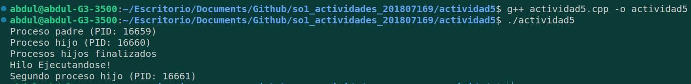

## Solución a la actividad 5

---

---

### En este presente documento responderemos a las preguntas que nos proporcionaron en la actividad las cuales son las siguientes:

- ¿Cuántos procesos únicos son creados?
- ¿Cuántos hilos únicos son creados?

---

---

## Respuesta 1:

### Son 3 procesos únicos, por los siguientes motivos:

---

---

El programa inicializa como un proceso padre. Después de la llamada a `fork()` inicial, se bifurca, creando un nuevo proceso hijo (Proceso 1). Luego, en el proceso padre, se realiza otra llamada a `fork()`, generando un segundo proceso hijo (Proceso 2). En total, hay tres procesos únicos: el proceso padre, el primer proceso hijo (Proceso 1) y el segundo proceso hijo (Proceso 2). Cada uno de estos procesos tiene su propio espacio de memoria y ejecuta su propio flujo de instrucciones de forma independiente.

---

---

## Respuesta 2:
### Se crea un único hilo por lo siguiente:

---

---

El código crea un hilo único en el primer proceso hijo (Proceso 1) utilizando la función pthread_create(). Este hilo ejecuta la función `thread_func()`. Sin embargo, en los otros procesos (el proceso padre y el segundo proceso hijo), no se crean hilos adicionales. Por lo tanto, solo se crea un hilo único en el primer proceso hijo (Proceso 1), lo que resulta en un total de un hilo único en todo el programa.

---

---

## Captura del resultado final

---

---

